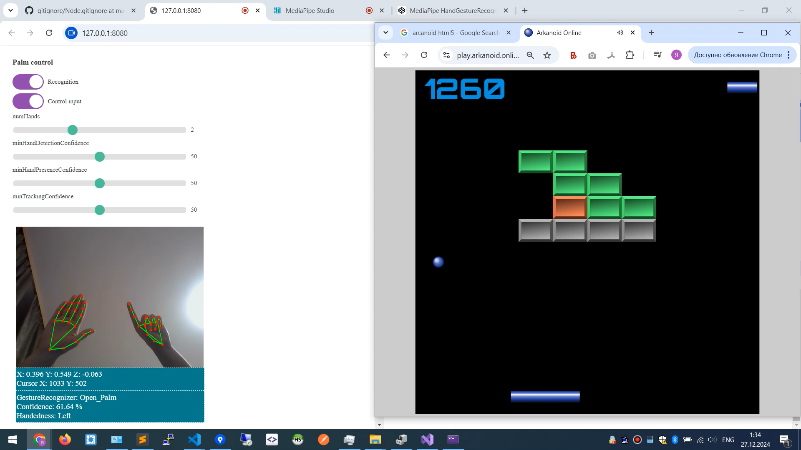

# Mouse control by hand  

 

Launch:  
1. SignalIrSetCursor2, start project in Visual Studio  
2. media_pipe_from_codepen_5_signalIR > npm run serv  
3. Open http://127.0.0.1:8080/  
   
Usage:  
Show open palm to web cam to enable cursor movement. Cursor is moved by index finger    
Example of game playable by mouse: https://play.arkanoid.online   

Based on:  
https://mediapipe-studio.webapps.google.com/studio/demo/gesture_recognizer  
https://ai.google.dev/edge/mediapipe/solutions/vision/gesture_recognizer  
https://codepen.io/mediapipe-preview/details/zYamdVd  

# Demo

  
  
